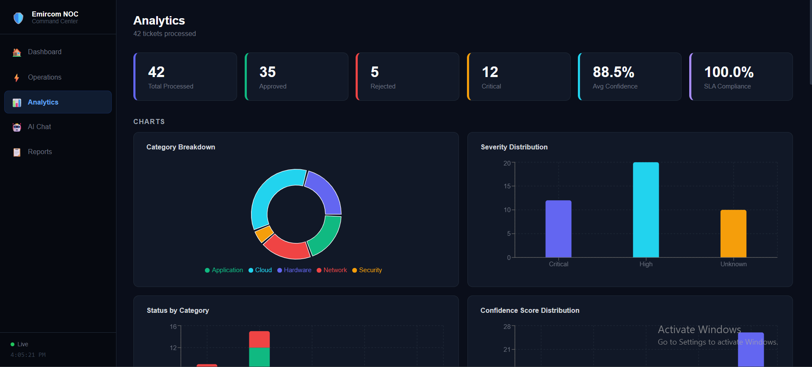
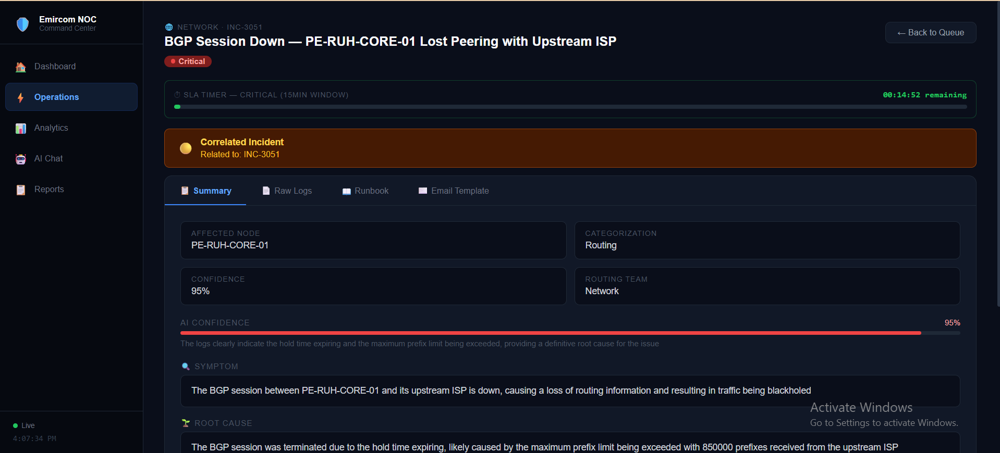
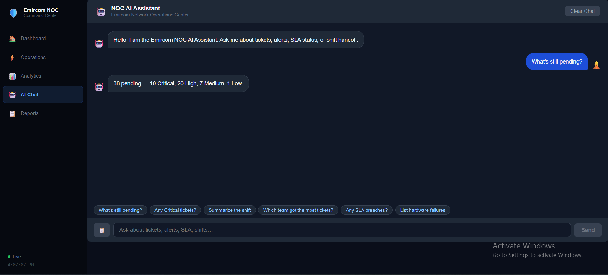
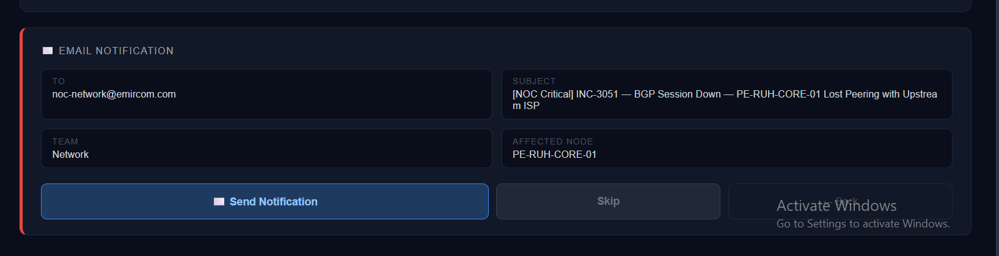
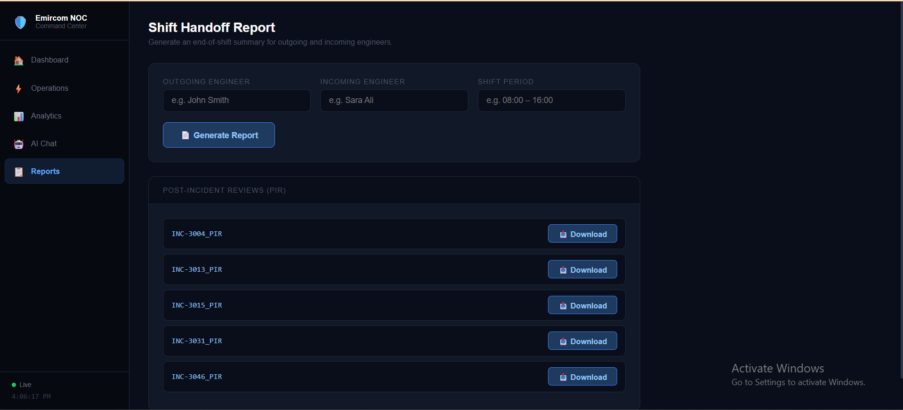

# Emircom NOC Agent 🛡️

An AI-powered Network Operations Centre (NOC) triage system built as a final-year internship project at Emircom. Incoming network alerts are routed through a multi-agent LangGraph pipeline, reviewed by a human engineer (HITL), then automatically creates a GLPI ticket and sends an email notification to the responsible team.

---

## Screenshots

| Dashboard | Operations (HITL) |
|-----------|------------------|
|  |  |

| Analytics | AI Chat |
|-----------|---------|
|  |  |

| Email Notification | Reports |
|-------------------|---------|
|  |  |

---

## What It Does

| Step | What happens |
|------|-------------|
| **Alert In** | Alert arrives from mock CSV, GLPI poll, or Meraki webhook |
| **Triage** | Ticket is received and logged |
| **Deduplication** | SQLite-backed LLM check — suppresses alert storms and repeated events |
| **Supervisor** | LLM re-classifies the category and routes to the right specialist |
| **Specialist Analysis** | One of 5 domain agents (Network / Security / Hardware / Cloud / Application) produces structured ITSM analysis |
| **Runbook RAG** | LLM searches 13 JSON runbooks and surfaces the best matching procedure |
| **Correlation** | LLM checks whether the current ticket shares a root cause with recent tickets |
| **HITL Pause** | Pipeline pauses — engineer reviews summary, raw logs, runbook, and email draft |
| **Approve / Drop** | Engineer approves → GLPI ticket created + email sent; or drops the duplicate |
| **Escalation** | If no engineer action within SLA threshold, a pulsing banner fires and an escalation email goes to the shift lead |

---

## Architecture

```
Alert Input
    │
    ▼
┌─────────────┐     ┌──────────────────┐
│  triage     │────▶│  deduplication   │
└─────────────┘     └────────┬─────────┘
                             │
                    duplicate? ──YES──▶ [drop] ──▶ END
                             │ NO
                             ▼
                    ┌─────────────────┐
                    │   supervisor    │  (LLM re-classifies category)
                    └────────┬────────┘
                             │
              ┌──────────────┼──────────────┐
              ▼              ▼              ▼
        network_ops   security_ops   hardware_ops
        cloud_ops     application_ops
              │
              ▼
        ┌──────────┐
        │ runbook  │  (LLM matches 1-of-13 JSON runbooks, conf ≥ 50%)
        └────┬─────┘
             ▼
        ┌─────────────┐
        │ correlation │  (LLM checks cross-ticket root cause)
        └──────┬──────┘
               │
        ══ HITL INTERRUPT ══  ◀── engineer reviews here
               │
               ▼
        ┌──────────┐
        │  remedy  │  → GLPI ticket + Gmail SMTP email
        └──────────┘
```

**LangGraph interrupt_before = ["remedy", "drop"]** — the graph pauses before any destructive or external action.

---

## Tech Stack

| Layer | Technology |
|-------|-----------|
| Agent pipeline | [LangGraph](https://langchain-ai.github.io/langgraph/) + raw Groq SDK (llama-3.3-70b-versatile) |
| React dashboard | React 19 + Vite + Recharts (`frontend/`) — primary UI |
| Streamlit UI | Python 3.14, Streamlit 1.x — reference UI (`streamlit/`) |
| REST backend | FastAPI (port 8001) |
| ITSM ticketing | GLPI (Docker) + REST API |
| Email | Gmail SMTP via App Password |
| Persistence | SQLite (agent state + dedup), JSON (audit log, session) |
| Runbook RAG | LLM-based retrieval over 13 local JSON runbooks (no vector DB) |
| Network alerts | Meraki webhook receiver (FastAPI, port 8003) |
| Cisco DevNet | DNA Center sandbox connector |

> **Note on LLM wiring:** `langchain_groq` hangs on Python 3.14 due to a pydantic v1 incompatibility. The project uses a lightweight `_LazyLLM` shim in `src/agent_graph.py` that calls the raw Groq SDK directly, exposing the same `.invoke()` / `.stream()` interface.

---

## Project Structure

```
src/
  agent_graph.py        # LangGraph pipeline — all nodes, AgentState, _LazyLLM shim
  email_sender.py       # Gmail SMTP email sender
  escalation_agent.py   # Pulsing banner + escalation email when HITL overdue
  rag_core.py           # Runbook retrieval — LLM over local JSON files

streamlit/              # Modular Streamlit UI
  app.py                # Entry point & UI orchestrator
  persistence.py        # Disk I/O — processed_tickets.json + session_state.json
  constants.py          # SLA thresholds, category icons, severity colours, team routing
  helpers.py            # Pure functions: extract_json, get_sla_status, save_and_advance
  reports.py            # Word .docx + Excel .xlsx report generators
  chatbot.py            # Tab 3 — NOC AI Assistant (streaming, scope-hardened)

frontend/               # React + Vite dashboard
  src/
    pages/
      Dashboard.jsx     # Alert queue, stat cards, shift briefing banner
      Operations.jsx    # HITL page — 4 tabs, 2-step approval wizard
      Analytics.jsx     # 6 KPI cards, 6 Recharts charts, audit log
      Chatbot.jsx       # SSE streaming chat, suggestion chips, Paste Logs
      Reports.jsx       # Shift handoff form, Excel export, PIR list

react/backend/
  main.py               # FastAPI backend for React frontend (port 8001)

glpi/
  glpi_agent.py         # Background worker — polls GLPI every 15s, posts AI comments
  push_to_glpi.py       # One-shot script to push test tickets to GLPI

cisco/
  devnet_connector.py   # Cisco DNA Center connector (DevNet sandbox)

meraki/
  webhook_receiver.py   # FastAPI Meraki webhook receiver (port 8003)
  meraki_parser.py      # Parses Meraki alert payloads

data/
  mock_tickets.csv      # 80 telecom-grade mock alerts (INC-3001 – INC-3080)
  emircom_runbooks/     # 13 runbook JSON files (NET × 6, SEC × 2, HW × 2, APP × 2, CLD × 1)
  processed_tickets.json  # Audit log — appended after each approval
  session_state.json    # Persists ticket_index across restarts
```

---

## Getting Started

### Prerequisites

- Python 3.14+
- Node.js 18+ (for React frontend)
- Docker Desktop (for GLPI)
- A [Groq API key](https://console.groq.com/) (free tier)
- A Gmail App Password (for email notifications)

### 1. Clone & install

```bash
git clone https://github.com/YznCodeX/Emircom_NOC_Agent.git
cd Emircom_NOC_Agent

python -m venv venv
venv\Scripts\activate          # Windows
pip install -r requirements.txt
```

### 2. Environment variables

Create a `.env` file in the project root:

```env
GROQ_API_KEY=your_groq_api_key_here
GMAIL_USER=your.email@gmail.com
GMAIL_APP_PASSWORD=your_gmail_app_password
SHIFT_LEAD_EMAIL=lead@example.com
```

### 3. Start GLPI (Docker)

```bash
docker start mariadb glpi
# GLPI available at http://localhost  (login: glpi / glpi)
```

### 4. Start all services (one command)

```powershell
.\start_noc.ps1
```

This starts:
| Service | URL |
|---------|-----|
| React dashboard | http://localhost:5173 |
| FastAPI backend | http://localhost:8001 |
| GLPI | http://localhost |

Or start individually:

```powershell
# Streamlit (main UI)
venv\Scripts\streamlit run streamlit/app.py

# FastAPI backend
venv\Scripts\uvicorn react.backend.main:app --port 8001 --reload

# React frontend
cd frontend && npm run dev

# GLPI background worker
venv\Scripts\python glpi/glpi_agent.py
```

---

## How to Use

1. Open **http://localhost:5173** (React dashboard)
2. Click **▶ Process** on any ticket in the queue — the pipeline runs through triage → supervisor → specialist → runbook → correlation, then pauses
3. Review the **HITL panel**: Summary / Raw Logs / Runbook / Email Template tabs
4. Click **Approve & Escalate** → confirm the email notification → ticket is created in GLPI and email is sent
5. Or click **Drop** to suppress a duplicate
6. Move to the next ticket and repeat

---

## Key Design Decisions

**No vector DB for RAG** — With 13 runbooks, a single LLM prompt that reads the runbook index and picks the best match is faster, cheaper, and more transparent than embedding + retrieval. Confidence threshold is 50%; below that the runbook tab is hidden.

**SQLite deduplication** — Alert history persists across restarts. The LLM compares the incoming description against the last 10 alerts; if it flags a match, the ticket is dropped before any API calls are made.

**Snapshot-based email panel** — When an engineer clicks Approve, ticket data is snapshotted into `email_snap_*` session variables. The email panel renders from snapshots, not live state, to prevent a "wrong ticket" race condition if the session advances.

**Groq free tier awareness** — The model is `llama-3.3-70b-versatile` at 12,000 TPM. Processing 2–3 tickets rapidly hits the limit; the UI surfaces the `429` error and the engineer waits ~60 seconds for the window to reset.

---

## Testing

```powershell
# Quick data + persistence check (no LLM calls)
venv\Scripts\python test_system.py

# Full pipeline test (makes LLM calls — uses Groq quota)
venv\Scripts\python test_pipeline.py
```

`test_system.py` verifies: CSV loading, persistence files, session state, SLA thresholds, and team routing.

`test_pipeline.py` runs a single ticket end-to-end through the agent graph (without GLPI/email) and checks that all nodes fire and the state fields are populated correctly.

---

## SLA Thresholds

| Severity | SLA | Escalation trigger |
|----------|-----|-------------------|
| Critical | 15 min | 5 min unacknowledged |
| High | 60 min | 15 min unacknowledged |
| Medium | 4 hours | — |
| Low | 24 hours | — |

---

## Runbooks

13 runbooks covering:
- **Network (6):** BGP failure, OSPF adjacency loss, interface flapping, MPLS LDP, high CPU, optical LOS
- **Security (2):** Brute force / failed logins, firewall policy breach
- **Hardware (2):** PSU failure, disk failure
- **Application (2):** Service crash, database connection error
- **Cloud (1):** VM crash / hypervisor fault

---

## Known Limitations

- Alert feed is a mock CSV (80 tickets, INC-3001–INC-3080); no live feed in this version
- GLPI runs locally via Docker; not connected to a production Remedy instance
- Email uses Gmail SMTP; Microsoft 365 / Teams integration is not yet implemented
- Groq free tier (12,000 TPM) limits throughput to ~2–3 tickets per minute

---

## Author

**Yazan** — Final-year AI student, unpaid trainee at Emircom  
Supervised project for graduation evaluation (presentation 40% / report 30% / supervisor 30%)

---

*Built with LangGraph, Streamlit, React, FastAPI, and GLPI.*
